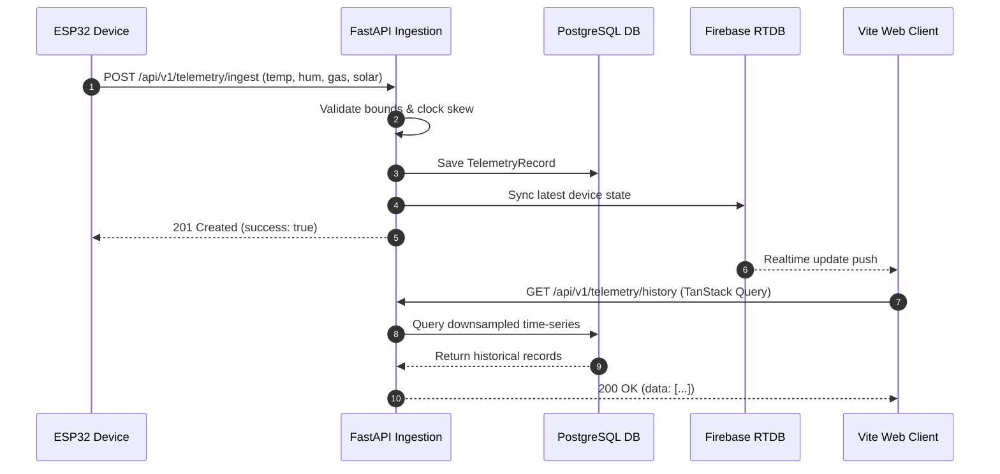

# HIMARKA End-to-End Data Flow

```mermaid
sequenceDiagram
    autonumber
    participant ESP as ESP32 Device
    participant API as FastAPI Ingestion
    participant DB as PostgreSQL DB
    participant FB as Firebase RTDB
    participant UI as Vite Web Client

    ESP->>API: POST /api/v1/telemetry/ingest (temp, hum, gas, solar)
    API->>API: Validate bounds & clock skew
    API->>DB: Save TelemetryRecord
    API->>FB: Sync latest device state
    API-->>ESP: 201 Created (success: true)
    FB-->>UI: Realtime update push
    UI->>API: GET /api/v1/telemetry/history (TanStack Query)
    API->>DB: Query downsampled time-series
    DB-->>API: Return historical records
    API-->>UI: 200 OK (data: [...])
```
