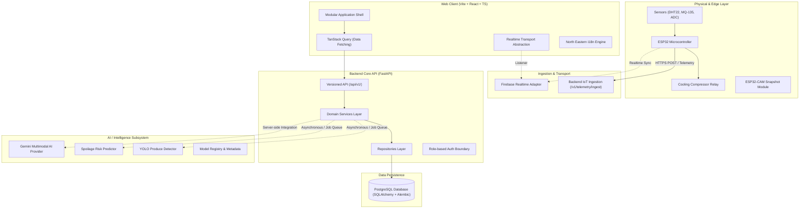

# HIMARKA Architecture Overview

**Solar-Powered Smart Mini Cold Storage System for Fresh Vegetables in the North Eastern Region of India**

---

## System Architecture Diagram

## Architectural Principles
1. **Separation of Concerns:** Frontend handles presentation; Backend governs domain logic and permissions; Database handles relational integrity; AI subsystem encapsulates inference; Firmware controls physical sensors and relays.
2. **Decoupled Realtime Layer:** Firebase operates behind an isolated adapter (`backend/app/integrations/firebase/`), preventing client SDK lock-in.
3. **Strict Validation & No Fake Data:** All incoming sensor telemetry and API calls are validated through Pydantic schemas. Unimplemented AI features respond with explicit `NOT_CONFIGURED` envelopes rather than fabricated metrics.
4. **Decentralized Regional Scalability:** Designed to scale from single cold chambers to village-level cooperatives across Assam, Nagaland, Meghalaya, Mizoram, Manipur, Arunachal Pradesh, Tripura, and Sikkim.
